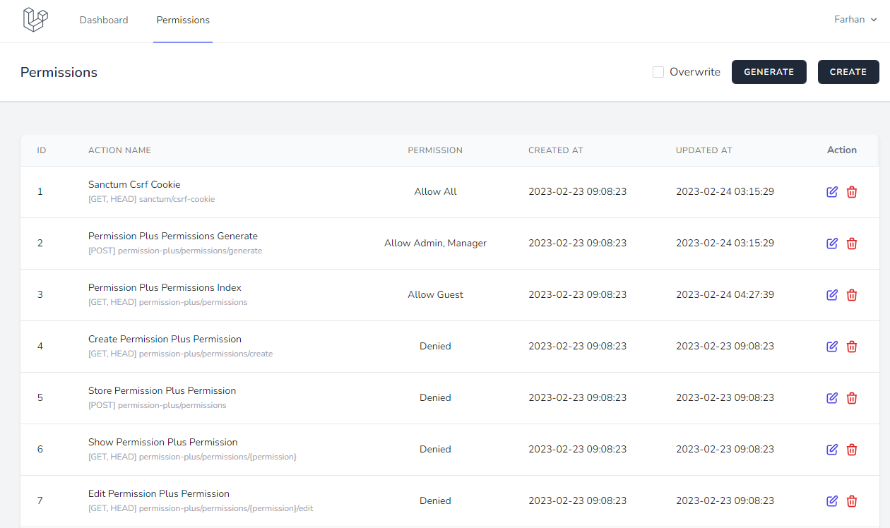
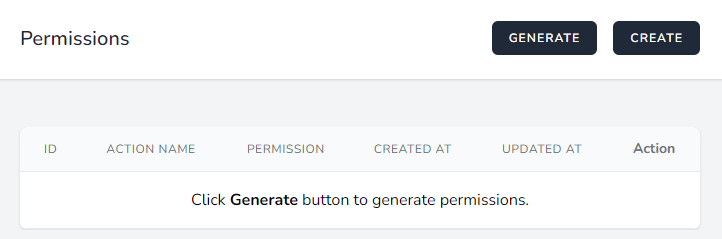

# Laravel Permission Plus

[](https://packagist.org/packages/laraditz/permission-plus)
[](https://packagist.org/packages/laraditz/permission-plus)


Laravel permission management for the lazy. The permission plus is a RRBAC (Role/Route Based Access Control) which is a method to restrict access control based on the application routes and roles. (Warning: This package is still in an early stage of development and may contains bugs).



## Installation

You can install the package via composer:

```bash
composer require laraditz/permission-plus
```

If you don't have one, you may create a new user account to be able to access the permission plus page. Use Laravel [starter kits](https://laravel.com/docs/master/starter-kits) to get ur application up and running in no time.


## Setup
Run the migration command to create the necessary database table.

```sh
php artisan migrate
```

Add `HasPermissionPlus` trait to your `User` model.

```php
use Laraditz\PermissionPlus\Traits\HasPermissionPlus;

class User extends Authenticatable
{
    use HasPermissionPlus;
}
```

(Optional) You can publish the config file via this command:
```sh
php artisan vendor:publish --provider="Laraditz\PermissionPlus\PermissionPlusServiceProvider" --tag="config"
```

## Usage
After login, go to `/permission-plus/permissions` to manage your permission and you will below page. You may click `Generate` button to generate all routes in your applications to start adding permissions. 



Repeat the step if you add more routes.

## Deploy to production
By default, all `App\Models\Users` can access Permission Page locally. To allow them to access Permission Page in production, you must take a few extra steps to ensure that only the correct users have access to the page.

To set up your `App\Models\User` to access Permission Page in non-local environments, you must overwrite the `canAccessPermissionPlus` method.

```php
public function canAccessPermissionPlus(): bool
{
    // example
    return str_ends_with($this->email, '@yourdomain.com') && $this->hasVerifiedEmail();
}
```

### Testing

```bash
composer test
```

### Changelog

Please see [CHANGELOG](CHANGELOG.md) for more information what has changed recently.

## Contributing

Please see [CONTRIBUTING](CONTRIBUTING.md) for details.

### Security

If you discover any security related issues, please email raditzfarhan@gmail.com instead of using the issue tracker.

## Credits

-   [Raditz Farhan](https://github.com/laraditz)
-   [All Contributors](../../contributors)

## License

The MIT License (MIT). Please see [License File](LICENSE.md) for more information.
